# 🛡️ Credit Card Fraud Detection ML Project (FraudSentinel)

This project demonstrates an **end-to-end Machine Learning pipeline** for detecting fraudulent credit card transactions.

From a business perspective, the goal is to:
- Reduce **financial losses due to fraud**
- Minimize **false alerts that disrupt genuine customers**
- Enable **risk-based transaction monitoring and prioritization**

The project addresses extreme class imbalance using **LightGBM with calibrated probabilities and custom threshold tuning**, and deploys a production-ready **Streamlit application (FraudSentinel)** for real-time fraud analysis.

---

## 📘 Table of Contents

- [Detailed Overview](#-detailed-overview)
- [🚀 Project Requirements](#-project-requirements)
- [ML Pipeline Architecture](#-ml-pipeline-architecture)
- [Exploratory Data Analysis](#-exploratory-data-analysis-eda)
- [Model Training & Comparison](#-model-training--comparison)
- [Final Model: LightGBM (Tuned)](#-final-model-lightgbm-tuned)
- [FraudSentinel – Frontend App](#-fraudsentinel--frontend-app)
- [Technologies Used](#-technologies-used)
- [Folder Structure](#-folder-structure)
- [How to Use](#-how-to-use)
- [Future Enhancements](#-future-enhancements)
- [Contact](#-contact)

---

## 🧩 Detailed Overview

The **Credit Card Fraud Detection ML Project** showcases how to build a **scalable, production-grade fraud detection system** on a highly imbalanced real-world dataset.

The primary objective is to **identify fraudulent transactions** with high precision and recall, while minimising false alarms that would disrupt legitimate customers.

This project highlights:

- **Exploratory Data Analysis (EDA)** — class imbalance analysis, feature correlation, transaction amount distributions
- **Baseline & Advanced Models** — EasyEnsemble, LightGBM, and XGBoost trained and evaluated head-to-head
- **Probability Calibration** — using `CalibratedClassifierCV` to produce reliable fraud probabilities
- **Custom Threshold Tuning** — optimising the decision boundary (threshold = 0.37) to balance precision and recall for the fraud use case
- **FraudSentinel** — an AI-powered Streamlit web app for real-time single and batch transaction analysis

The repository serves as a practical reference for **data scientists and ML engineers** looking to build production-grade fraud detection pipelines.

---

## 🚀 Project Requirements

### 🧠 Objective

Build a **machine learning-based fraud detection system** that accurately classifies credit card transactions as legitimate or fraudulent, with emphasis on minimising missed frauds (false negatives) while keeping false alarms (false positives) low.

### 📋 Specifications

- **Dataset:** European credit card transactions (284,807 rows, 492 fraud cases — 0.1727% fraud rate)
- **Features:** 30 features — V1–V28 (PCA-transformed), Time, Amount
- **Imbalance Handling:** Class weights (`class_weight='balanced'`) + custom threshold tuning
- **Models Evaluated:** EasyEnsemble, LightGBM, XGBoost
- **Final Model:** LightGBM with calibrated probabilities, threshold tuned at 0.37
- **Deployment:** Streamlit web application (FraudSentinel)
- **Documentation:** Full EDA, model evaluation dashboards, confusion matrices, ROC and PR curves

---

## 🏗️ ML Pipeline Architecture

**End-to-End Pipeline Flow:**

1. Raw CSV data (Kaggle — European credit card transactions)
2. Exploratory Data Analysis — class imbalance, feature correlations, amount distributions
3. Feature engineering & preprocessing — StandardScaler on Amount & Time
4. Model training — EasyEnsemble, LightGBM, XGBoost with class weights
5. Probability calibration — `CalibratedClassifierCV` wrapping LightGBM
6. Threshold tuning — optimal threshold selected at 0.37 via PR curve analysis
7. Model evaluation — ROC-AUC, PR-AUC, Precision, Recall, F1, Specificity, Confusion Matrices
8. Deployment — FraudSentinel Streamlit app for real-time inference

**Model Pipeline (Serialised):**
```
StandardScaler → LGBMClassifier → CalibratedClassifierCV
Output: Fraud Probability [0–1] → Threshold @ 0.37 → Binary Prediction
```

---

## 🔍 Exploratory Data Analysis (EDA)

### Class Imbalance

The dataset is severely imbalanced — only **492 fraud cases out of 284,807 transactions** (imbalance ratio **578:1**). Accuracy is therefore a misleading metric; PR-AUC and F1 are used as primary evaluation criteria.

| Metric | Value |
|---|---|
| Total Transactions | 284,807 |
| Legit Transactions | 284,315 |
| Fraud Transactions | 492 |
| Fraud Rate | 0.1727% |
| Imbalance Ratio | 578 : 1 |

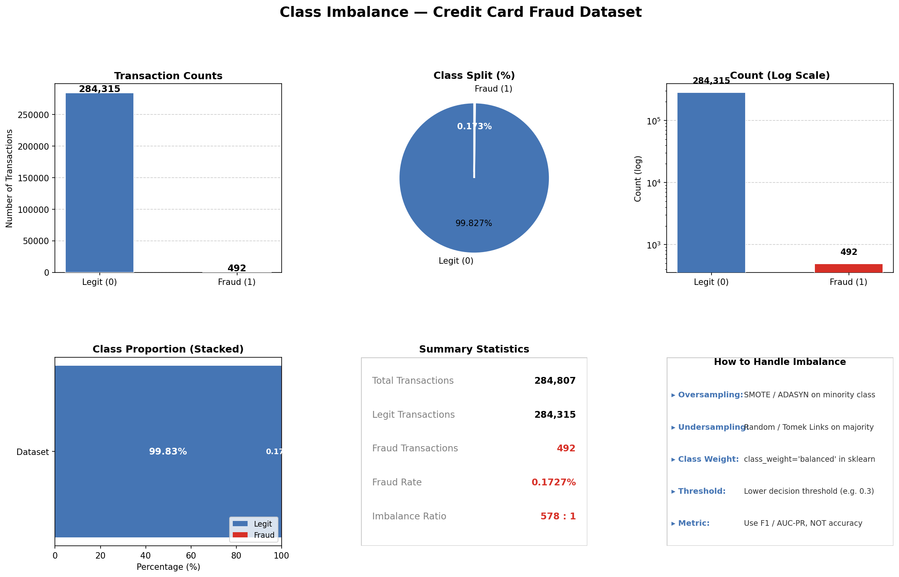

👉 **Business Insight:**  
The extremely low fraud rate (0.17%) means traditional accuracy is misleading.  
The focus must be on **precision (reducing false alerts)** and **recall (catching frauds)**.

### Transaction Amount Distribution

Fraudulent transactions tend to cluster at **lower transaction amounts** compared to legitimate ones, as visible in both the boxplot and KDE comparison. Legitimate transactions show a much wider spread with large outliers up to $25,000+.

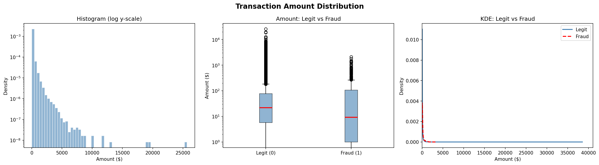

### Feature Correlation with Fraud Label

Features **V17 (−0.326), V14 (−0.303), V12 (−0.261), V10 (−0.217)** show the strongest negative correlations with the fraud label, while **V11 (+0.155), V4 (+0.133), V2 (+0.091)** are the most positively correlated. These PCA components are the most discriminative for the model.

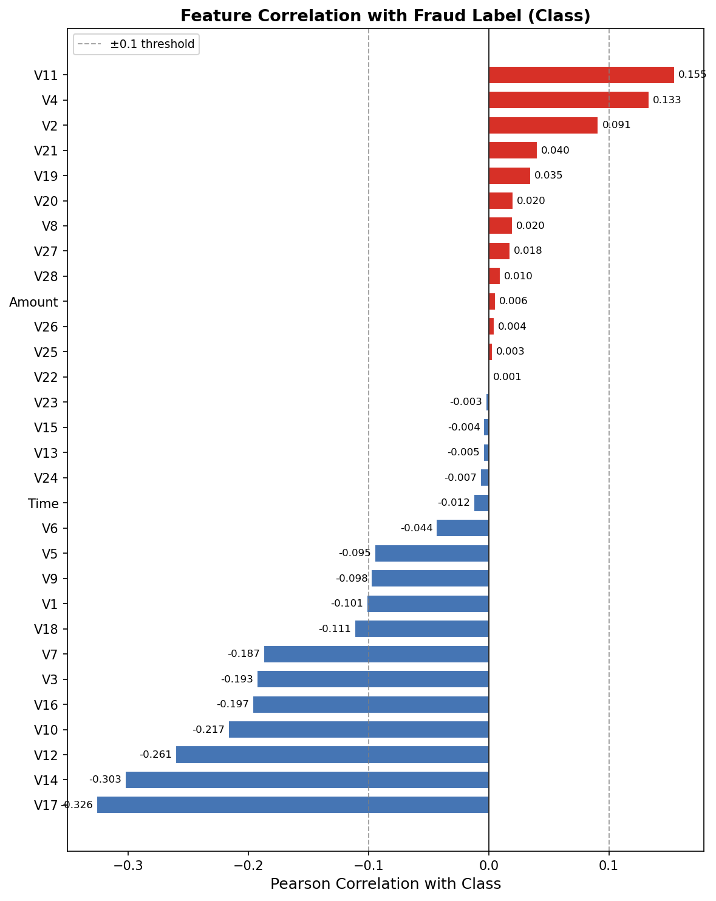

### Clustered Correlation Heatmap

The clustered heatmap of all 30 features (V1–V28, Time, Amount) confirms that most PCA components are near-orthogonal by design, with a few notable inter-correlations — most prominently **V2 and Amount (−0.53)** and **V7 and V5 (+0.40)**.

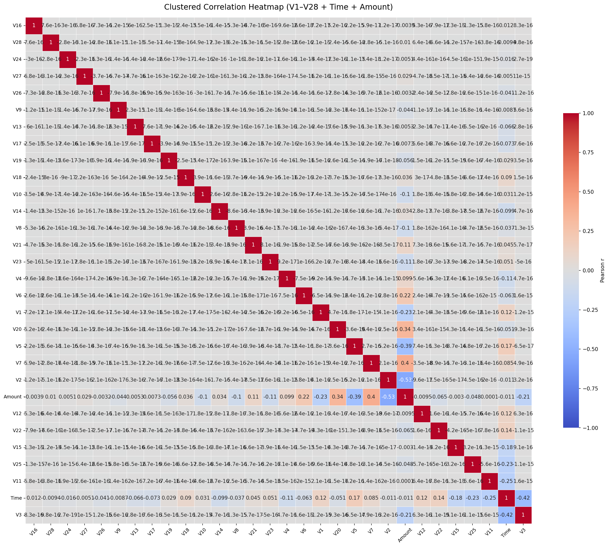

---

## 📊 Model Training & Comparison

Three models were trained and evaluated against each other: **EasyEnsemble**, **LightGBM**, and **XGBoost**.

### Model Performance Comparison

LightGBM achieves the **best overall balance** across PR-AUC, Precision, and F1, making it the chosen final model. EasyEnsemble achieves the highest Recall (0.92) but at the cost of only 0.06 Precision and 1,379 false positives — unacceptable for production.

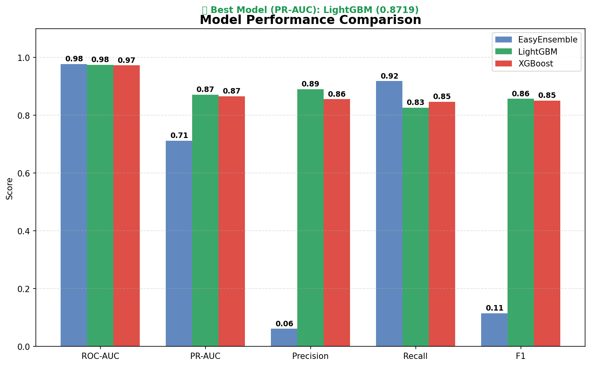

### Full Model Metrics Comparison

| Metric | EasyEnsemble | LightGBM | XGBoost |
|---|---|---|---|
| **ROC-AUC** | 0.9781 | 0.9752 | 0.9728 |
| **PR-AUC** | 0.7121 | **0.8719** ✅ | 0.8656 |
| **Precision** | 0.0416 | **0.8900** ✅ | 0.8600 |
| **Recall** | **0.9286** | 0.8300 | 0.8500 |
| **F1 Score** | 0.0795 | **0.8600** ✅ | 0.8500 |
| **False Negatives (FN)** | 7 | 17 | 15 |
| **False Positives (FP)** | 1,379 | **10** ✅ | 14 |

> ✅ **LightGBM selected as final model** — best PR-AUC (0.8719), highest precision (0.89), and lowest false positives (10).

### ROC Curve Comparison

All three models achieve ROC-AUC scores above 0.97, showing strong discriminative ability. EasyEnsemble edges ahead slightly (0.9781) but this advantage is misleading due to its extremely poor precision.

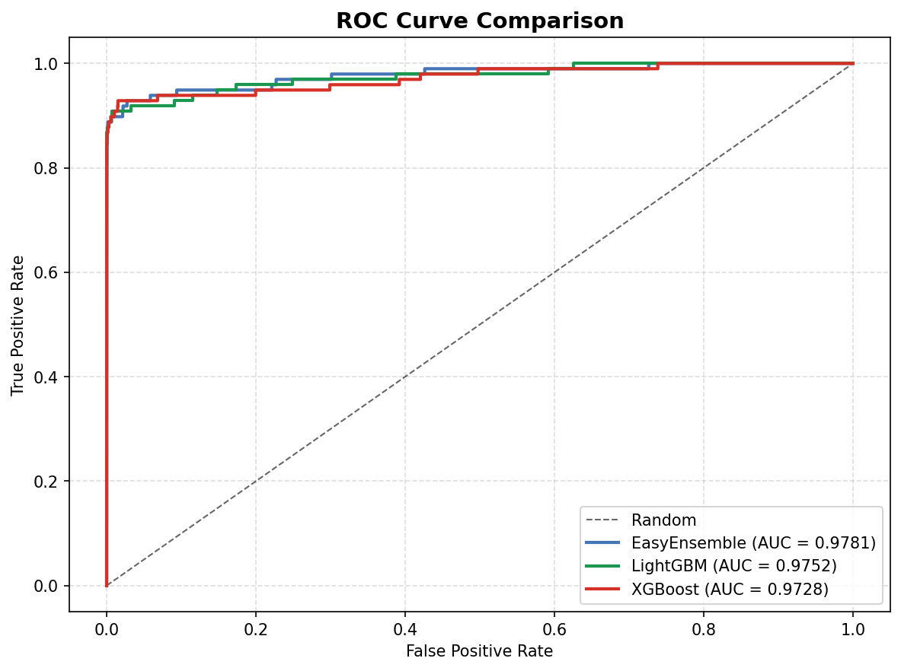

### Precision-Recall Curve Comparison

The PR curve is the critical metric for imbalanced fraud detection. **LightGBM (PR-AUC = 0.8719)** outperforms XGBoost (0.8656) and significantly outperforms EasyEnsemble (0.7121).

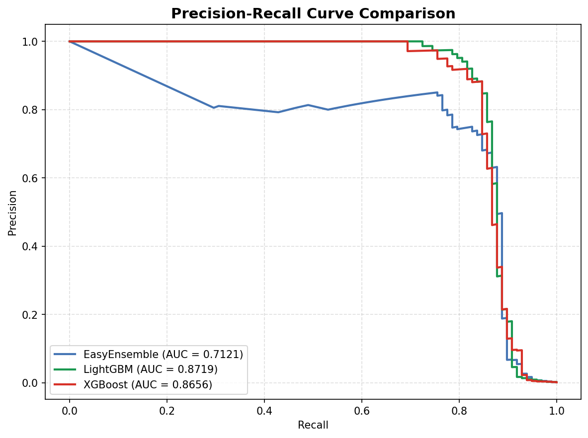

### Confusion Matrix Comparison

LightGBM achieves only **10 false positives** vs. EasyEnsemble's 1,379 — a 138× reduction in false alarms, making it far more viable for a production banking system.

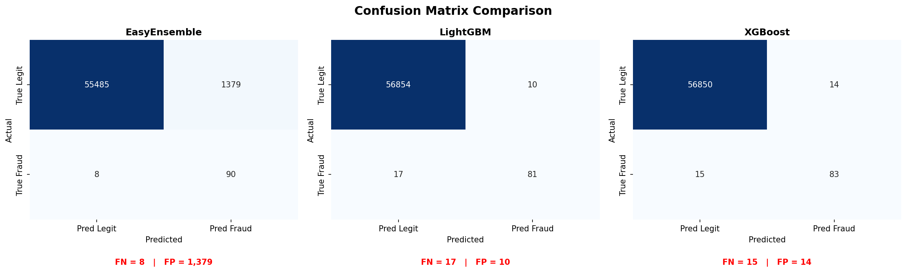

---

## 🏆 Final Model: LightGBM (Tuned)

### EasyEnsemble — Pre-Tuning Evaluation Dashboard

EasyEnsemble was evaluated first as a baseline. While it achieves high recall (92.86%), it generates **2,099 false positives** — flagging 3.69% of all legitimate transactions as fraud. This makes it unsuitable for production despite the low miss rate.

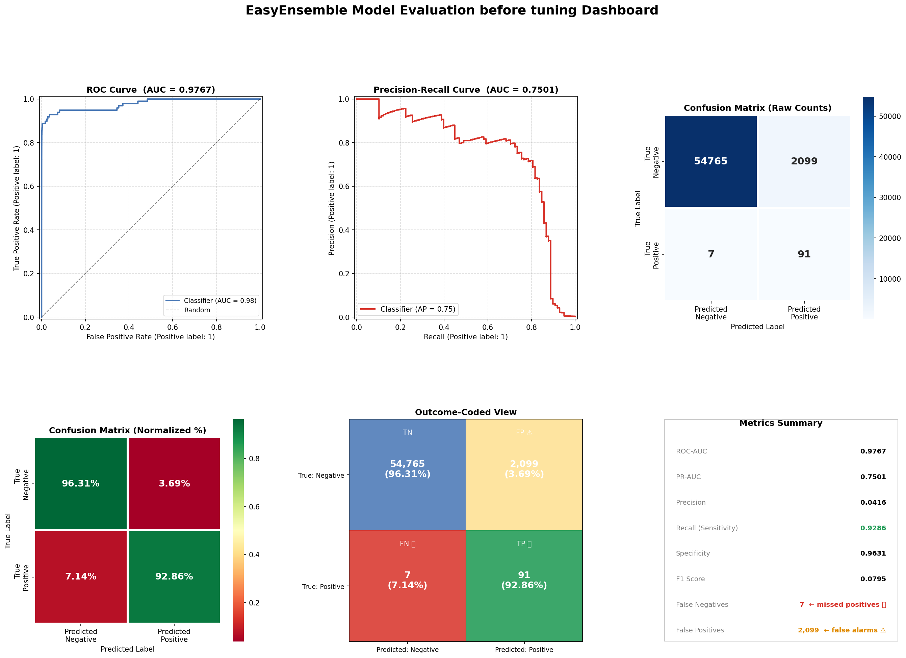

**EasyEnsemble Metrics Summary:**

| Metric | Value |
|---|---|
| ROC-AUC | 0.9767 |
| PR-AUC | 0.7501 |
| Precision | 0.0416 |
| Recall (Sensitivity) | 0.9286 |
| Specificity | 0.9631 |
| F1 Score | 0.0795 |
| True Negatives (TN) | 54,765 (96.31%) |
| True Positives (TP) | 91 (92.86%) |
| False Negatives (FN) | 7 ← missed frauds |
| False Positives (FP) | 2,099 ← false alarms |

---

### LightGBM — Pre-Tuning Evaluation Dashboard

LightGBM out-of-the-box delivers dramatically better results — only **8 false positives** while maintaining 82.65% fraud recall. Its PR-AUC of 0.8802 confirms it as the strongest candidate for threshold tuning.

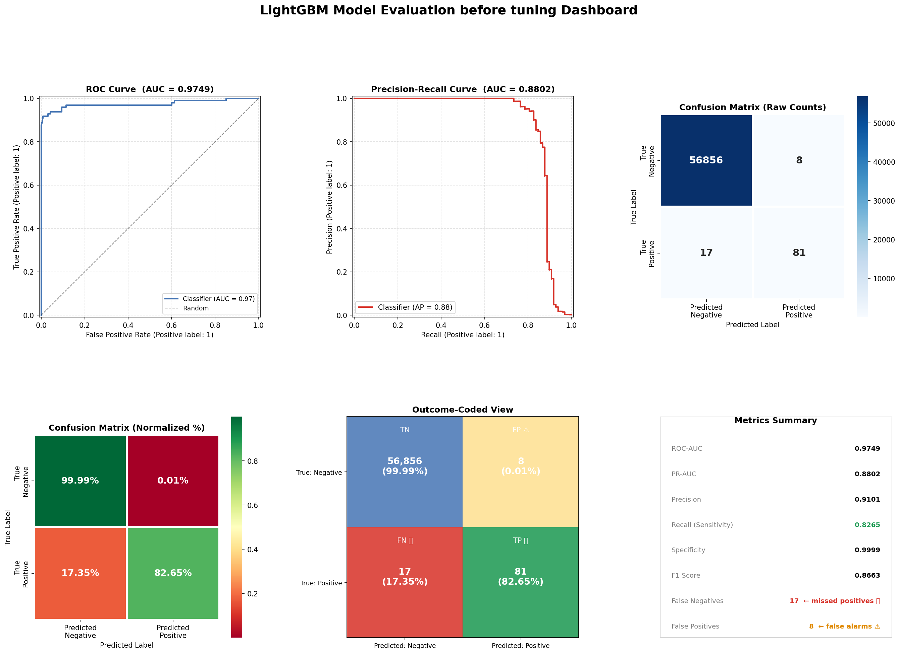

**LightGBM Pre-Tuning Metrics Summary:**

| Metric | Value |
|---|---|
| ROC-AUC | 0.9749 |
| PR-AUC | 0.8802 |
| Precision | 0.9101 |
| Recall (Sensitivity) | 0.8265 |
| Specificity | 0.9999 |
| F1 Score | 0.8663 |
| True Negatives (TN) | 56,856 (99.99%) |
| True Positives (TP) | 81 (82.65%) |
| False Negatives (FN) | 17 ← missed frauds |
| False Positives (FP) | 8 ← false alarms |

---

### Threshold Tuning

The default decision threshold (0.5) was replaced with a **custom threshold of 0.37**, identified via Precision-Recall curve analysis. Lowering the threshold increases fraud recall at the cost of a marginal increase in false positives — the optimal trade-off for this use case.

**LightGBM Tuned Metrics at Threshold = 0.37:**

| Metric | Value |
|---|---|
| **Threshold** | 0.37 |
| **Precision** | 0.9111 |
| **Recall (Sensitivity)** | 0.8367 |
| **F1 Score** | 0.8723 |
| **True Negatives (TN)** | 56,856 (99.99%) |
| **True Positives (TP)** | 82 (83.67%) |
| **False Negatives (FN)** | 16 (16.33%) ← missed frauds |
| **False Positives (FP)** | 8 (0.01%) ← false alarms |

### Confusion Matrix at Custom Threshold (0.37)

With threshold = 0.37, the tuned model correctly identifies **82 out of 98 fraud cases** while generating only **8 false alarms** out of 56,864 legitimate transactions — a near-perfect balance for a production fraud detection system.

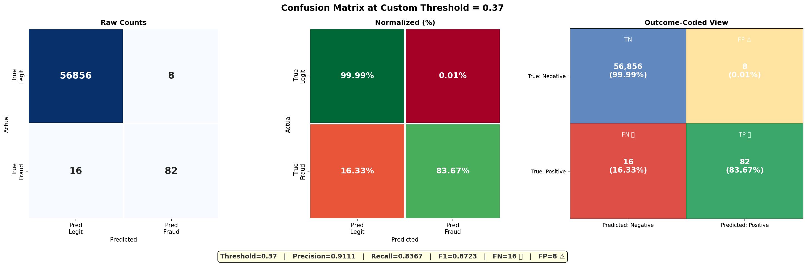

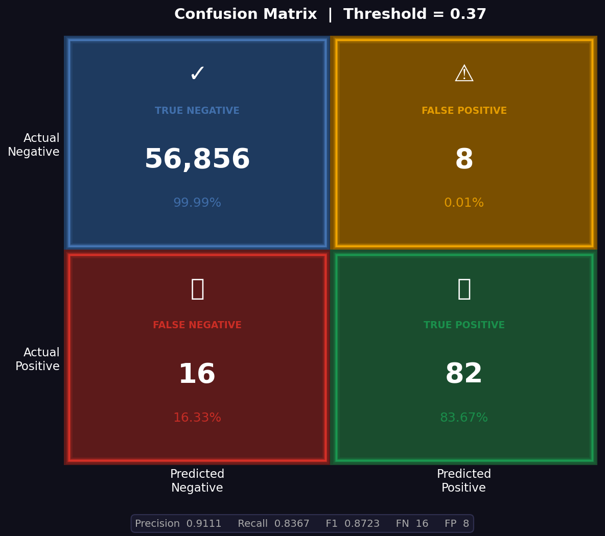

---

## 💻 FraudSentinel – Frontend App

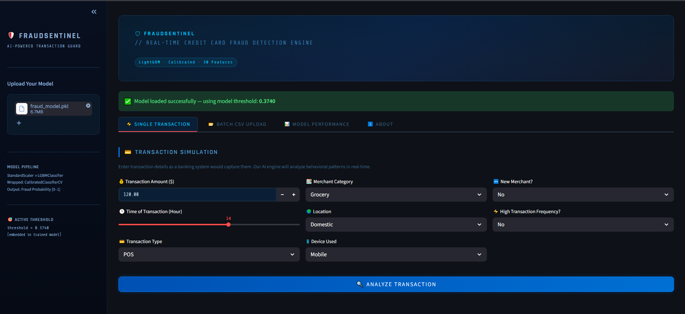

**FraudSentinel** is a production-style Streamlit web application built around the trained and calibrated LightGBM model. It offers real-time fraud detection with an intuitive dark-themed interface.

FraudSentinel is used to:

- Perform **real-time single transaction** fraud scoring by entering transaction details (amount, time, merchant category, location, device, transaction type)
- Run **batch transaction scoring** via CSV upload for bulk analysis
- Monitor **live model performance metrics** and evaluation charts
- Inspect the **active decision threshold** (0.3740) embedded in the loaded model
- View the full **inference pipeline**: `StandardScaler → LGBMClassifier → CalibratedClassifierCV`

---

## ⚙️ Technologies Used

| Category | Tools / Technologies |
|---|---|
| **Language** | Python 3.x |
| **ML Framework** | Scikit-learn, LightGBM, XGBoost, imbalanced-learn |
| **Calibration** | `CalibratedClassifierCV` (Scikit-learn) |
| **Imbalance Handling** | Class Weights (`class_weight='balanced'`) |
| **Data Processing** | Pandas, NumPy |
| **Visualisation** | Matplotlib, Seaborn |
| **Frontend / Deployment** | Streamlit |
| **Model Serialisation** | Pickle (`.pkl`) |
| **Notebook Environment** | Jupyter Notebook |
| **Dataset Source** | Kaggle (European Credit Card Transactions, 2013) |

---

## 📁 Folder Structure

```
Credit_Card_Fraud_detection_ML_Project/
│
├── data/                          # Dataset
│   └── creditcard.csv
│
├── notebooks/                     # Jupyter Notebooks
│   ├── 01_EDA.ipynb
│   ├── 02_Model_Training.ipynb
│   ├── 03_Threshold_Tuning.ipynb
│   └── 04_Model_Evaluation.ipynb
│
├── models/                        # Serialised models
│   └── fraud_model.pkl
│
├── app/                           # Streamlit frontend (FraudSentinel)
│   └── app.py
│
├── Images/                        # EDA & evaluation visuals
│   ├── amount_distribution.png
│   ├── class_correlation.png
│   ├── class_imbalance.png
│   ├── Confusion_Matrix_Comparison.png
│   ├── confusion_matrix_custom_threshold.png
│   ├── evaluation_dashboard.png
│   ├── Front_end.PNG
│   ├── heatmap_clustered.png
│   ├── lightGBM_evaluation_dashboard.png
│   ├── LightGBM_tunned_confusion_matrix.png
│   ├── model_comparison.png
│   ├── Precision-Recall_Curve_Comparison.png
│   └── ROC_Curve_Comparison.png
│
├── README.md
├── requirements.txt
└── LICENSE
```

---

## 🚀 How to Use

1. **Clone the repository**

```bash
git clone https://github.com/AmulyaKadam/Credit_Card_Fraud_detection_ML_Project.git
cd Credit_Card_Fraud_detection_ML_Project
```

2. **Install dependencies**

```bash
pip install -r requirements.txt
```

3. **Download the dataset**

- Download `creditcard.csv` from [Kaggle](https://www.kaggle.com/datasets/mlg-ulb/creditcardfraud)
- Place it in the `data/` directory

4. **Run EDA and Model Training Notebooks**

- Open notebooks in `notebooks/` sequentially
- Run `01_EDA.ipynb` → `02_Model_Training.ipynb` → `03_Threshold_Tuning.ipynb` → `04_Model_Evaluation.ipynb`

5. **Launch the FraudSentinel App**

```bash
streamlit run app/app.py
```

6. **Use the App**

- Upload `fraud_model.pkl` via the sidebar
- Use **Single Transaction** mode for real-time prediction
- Use **Batch CSV Upload** for bulk transaction scoring
- View model metrics under the **Model Performance** tab

---

## 🔮 Future Enhancements

- Implement **real-time streaming** fraud detection using Apache Kafka
- Add **SHAP explainability** to show per-prediction feature contributions
- Explore **deep learning approaches** (Autoencoder, LSTM for sequential transactions)
- Add **data drift monitoring** using Evidently AI
- Implement **CI/CD pipeline** for automated model retraining and deployment
- Integrate a **REST API** (FastAPI) for production-grade microservice deployment
- Explore **graph-based fraud detection** leveraging transaction network relationships

---

## 👤 Contact

**Author:** Amulya Kadam
📧 **Email:** [kadamamulya017@gmail.com](mailto:kadamamulya017@gmail.com)
💼 **GitHub:** [AmulyaKadam](https://github.com/AmulyaKadam)
🔗 **LinkedIn:** [www.linkedin.com/in/amulya-kadam-8b3647208](http://www.linkedin.com/in/amulya-kadam-8b3647208)

---

⭐ *If you found this project helpful, please star the repository!*
